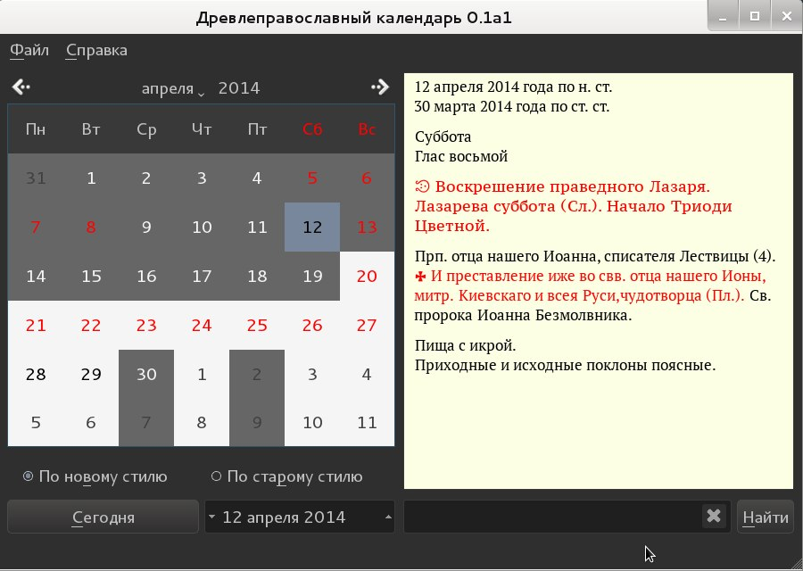

============
holydate-gui
============

.. image:: https://d2weczhvl823v0.cloudfront.net/vechnoe/holydate-gui/trend.png
   :alt: Bitdeli badge
   :target: https://bitdeli.com/free
 

Description
===========
The package **holydate-gui** represent
GUI interface for Holydate. This package represents the
ancient Orthodox calendar for Oldbelievers (better known as
Starovery or Staroobryadts). Evaluates daily feasts,
and Gregorian dates, fasts and bows.
Contains an engine for searching Saints and feasts in the Menology,
the Visual Paschalion.

Instalation
===========

From repository (temporarily not available):

Add your /etc/apt/sources.list :

::

    deb http://repository.drevle.com/ testing main

Then:

::

    apt-key adv --recv-keys --keyserver pgp.mit.edu 270904ED
    aptitude update
    aptitude install holydate-gui

Authors
=======

* Author: `Maxim Chernyatevich`_

.. _`Maxim Chernyatevich`: https://github.com/vechnoe

Dependencies
============

*Required*

* `Python 2.7.x. <http://python.org/download/>`_

*Required*

* `PyQt4 <https://pypi.python.org/pypi/PyQt4/>`_

*Required*

* `Holydate <https://pypi.python.org/pypi/holydate/>`_

*Required*

* `QDarkStyleSheet <https://github.com/ColinDuquesnoy/QDarkStyleSheet/>`_

License
=======

Copyright 2013-2014 Maxim Chernyatevich (http://www.vechnoe.info)

`GNU General Public License v3 or later <http://www.gnu.org/licenses/>`_
